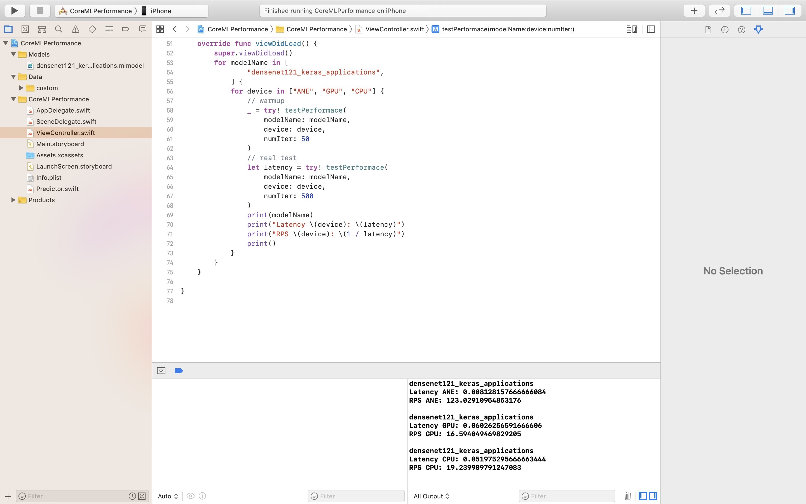

# CoreML Performance

This repo allows to test the **performance** of Machine Learning models in **CoreML** *\*.mlmodel* format.

The code was initially designed to work with all the models in [**CoreML Model Zoo**](https://github.com/vladimir-chernykh/coreml-model-zoo). But with a bit of tweaking it could work for any CoreML model.

# Quick Start

1. **Clone** the project
   ```bash
   git clone https://github.com/vladimir-chernykh/coreml-performance.git
   ```
2. Open **XCode**. The code was tested in XCode 11.5.
3. Go to *File -> Open* and choose *CoreMLPerformance.xcodeproj* in the repo just cloned.
4. **Build** and **Run** the project using either *simulator* or *real device*.
5. The results of the performance testing will be **printed to console**:
   * Latency
   * RPS (= 1 / Latency)



# Setting
